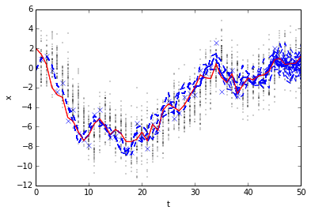

Basic Model
===========

Demonstrates a simple integrator model. Start by imported the interface classes from pyparticleest and the main simulator class
                                                                                                                               

.. code:: python

    %matplotlib inline
    import numpy
    import pyparticleest.utils.kalman as kalman
    import pyparticleest.interfaces as interfaces
    import matplotlib.pyplot as plt
    import pyparticleest.simulator as simulator

First we need the generate a dataset, it contains a true trajectory x and an array of measurements y. The goal is to estimate x using the data in y.
                                                                                                                                                    

.. code:: python

    def generate_dataset(steps, P0, Q, R):
        x = numpy.zeros((steps + 1,))
        y = numpy.zeros((steps,))
        x[0] = 2.0 + 0.0 * numpy.random.normal(0.0, P0)
        for k in range(1, steps + 1):
            x[k] = x[k - 1] + numpy.random.normal(0.0, Q)
            y[k - 1] = x[k] + numpy.random.normal(0.0, R)
    
        return (x, y)

We need to specify the model which estimation is based upon, for this example we implement it directly on top of the interface specifications. More commonly one would use one of the base classes for a specific class of model to reduce the amount of code needed.
                                                                                                                                                                                                                                                                     

.. code:: python

    class Model(interfaces.ParticleFiltering):
        """ x_{k+1} = x_k + v_k, v_k ~ N(0,Q)
            y_k = x_k + e_k, e_k ~ N(0,R),
            x(0) ~ N(0,P0) """
    
        def __init__(self, P0, Q, R):
            self.P0 = numpy.copy(P0)
            self.Q = numpy.copy(Q)
            self.R = numpy.copy(R)
    
        def create_initial_estimate(self, N):
            return numpy.random.normal(0.0, self.P0, (N,)).reshape((-1, 1))
    
        def sample_process_noise(self, particles, u, t):
            """ Return process noise for input u """
            N = len(particles)
            return numpy.random.normal(0.0, self.Q, (N,)).reshape((-1, 1))
    
        def update(self, particles, u, t, noise):
            """ Update estimate using 'data' as input """
            particles += noise
    
        def measure(self, particles, y, t):
            """ Return the log-pdf value of the measurement """
            logyprob = numpy.empty(len(particles), dtype=float)
            for k in range(len(particles)):
                logyprob[k] = kalman.lognormpdf(particles[k].reshape(-1, 1) - y, self.R)
            return logyprob
    
        def logp_xnext_full(self, part, past_trajs, pind,
                            future_trajs, find, ut, yt, tt, cur_ind):
    
            diff = future_trajs[0].pa.part[find] - part
    
            logpxnext = numpy.empty(len(diff), dtype=float)
            for k in range(len(logpxnext)):
                logpxnext[k] = kalman.lognormpdf(diff[k].reshape(-1, 1), numpy.asarray(self.Q).reshape(1, 1))
            return logpxnext

Define length of dataset and some parameters for the model defined above
                                                                        

.. code:: python

    steps = 50
    num = 50
    P0 = 1.0
    Q = 1.0
    R = numpy.asarray(((1.0,),))

Generate the dataset, but first set the seed for the random number generator so we always get the same example
                                                                                                              

.. code:: python

    numpy.random.seed(1)
    (x, y) = generate_dataset(steps, P0, Q, R)

Instantiate the model and create the simulator object using the model and measurement y. This example does not use an input signal therefore set u=None
                                                                                                                                                       

.. code:: python

    model = Model(P0, Q, R)
    sim = simulator.Simulator(model, u=None, y=y)

Perform the estimation, using 'num' as both the number of forward particle and backward trajectories. For the smoother simply use the ancestral paths of each particle at the end time.
                                                                                                                                                                                       

.. code:: python

    sim.simulate(num, num, smoother='ancestor')

.. parsed-literal::

    33

Extract filtered and smoothed estimates
                                       

.. code:: python

    (vals, _) = sim.get_filtered_estimates()
    svals = sim.get_smoothed_estimates()

Plot true trajectory, measurements and the filtered and smoothed estimates
                                                                          

.. code:: python

    plt.plot(range(steps + 1), x, 'r-')
    plt.plot(range(1, steps + 1), y, 'bx')
    plt.plot(range(steps + 1), vals[:, :, 0], 'k.', markersize=0.8)
    plt.plot(range(steps + 1), svals[:, :, 0], 'b--')
    plt.plot(range(steps + 1), x, 'r-')
    plt.xlabel('t')
    plt.ylabel('x')

.. parsed-literal::

    <matplotlib.text.Text at 0x7f654682bc10>

