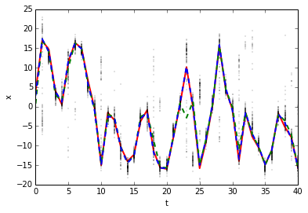

Standard Nonlinear Model
========================

Example code for estimation the standard nonlinear model typically found in articles about particle filters
                                                                                                           

Import needed packages, from pyparticleest we use the base class for nonlinear models with additive Gaussian noise (NLG). We also use the simulator class as an easy interface to the actual algorithm inside pyparticleest.
                                                                                                                                                                                                                            

.. code:: python

    %matplotlib inline
    import numpy
    import math
    import pyparticleest.models.nlg as nlg
    import pyparticleest.simulator as simulator
    import matplotlib.pyplot as plt

Generate true trajectory x and measurements y. The goal is the create an estimate of x by only using the measurements y later in the code
                                                                                                                                         

.. code:: python

    def generate_dataset(steps, P0, Q, R):
        x = numpy.zeros((steps + 1,))
        y = numpy.zeros((steps + 1,))
        x[0] = numpy.random.multivariate_normal((0.0,), P0)
        y[0] = (0.05 * x[0] ** 2 +
                numpy.random.multivariate_normal((0.0,), R))
        for k in range(0, steps):
            x[k + 1] = (0.5 * x[k] +
                        25.0 * x[k] / (1 + x[k] ** 2) +
                        8 * math.cos(1.2 * k) +
                        numpy.random.multivariate_normal((0.0,), Q))
            y[k + 1] = (0.05 * x[k + 1] ** 2 +
                        numpy.random.multivariate_normal((0.0,), R))
    
        return (x, y)

Define the model for the standard nonlinaer example, it is of the type Nonlinear Gaussian with an initial Gaussian distribution of the states aswell. We therefore use the nlg.NonlinearGaussianInitialGaussian base class and only override the calc\_g and calc\_f methods.
                                                                                                                                                                                                                                                                             

.. code:: python

    class StdNonLin(nlg.NonlinearGaussianInitialGaussian):
        # x_{k+1} = 0.5*x_k + 25.0*x_k/(1+x_k**2) +
        #           8*math.cos(1.2*k) + v_k = f(x_k) + v:
        # y_k = 0.05*x_k**2 + e_k = g(x_k) + e_k,
        # x(0) ~ N(0,P0), v_k ~ N(0,Q), e_k ~ N(0,R)
    
        def __init__(self, P0, Q, R):
    	# Set covariances in the constructor since they
    	# are constant
            super(StdNonLin, self).__init__(Px0=P0, Q=Q, R=R)
    
        def calc_g(self, particles, t):
    	# Calculate value of g(\xi_t,t)
            return 0.05 * particles ** 2
    
        def calc_f(self, particles, u, t):
    	# Calculate value of f(xi_t,t)
            return (0.5 * particles +
                    25.0 * particles / (1 + particles ** 2) +
                    8 * math.cos(1.2 * t))
        
Define the length of the dataset and the noise parameters for our model.
                                                                        

.. code:: python

    T = 40
    P0 = 5.0 * numpy.eye(1)
    Q = 1.0 * numpy.eye(1)
    R = 0.1 * numpy.eye(1)
    
    # Forward particles
    N = 100
    # Backward trajectories
    M = 10

Instantiate our model using the parameters defined above.
                                                         

.. code:: python

    model = StdNonLin(P0, Q, R)

Set the seed of the random number generator so that the same dataset is generated each time the example is run.
                                                                                                               

.. code:: python

    numpy.random.seed(0)
    (x, y) = generate_dataset(T, P0, Q, R)

Create a simulator object using our previously instatiated model combined with the measurements y. This example doesn't use any input signals u. Use N particle for the filter, M trajectories for the smoother. For the filtering algorithm use the standard bootstrap particle filter, for the smoothing use backward simulation with rejections sampling and adaptive stopping. Indicate that the first measurement is of the initial state. (If false the first measurement would have corresponding to after propagating the states forward in time once first).
                                                                                                                                                                                                                                                                                                                                                                                                                                                                                                                                                                     

.. code:: python

    sim = simulator.Simulator(model, u=None, y=y)
    sim.simulate(N, M, filter='PF', smoother='rsas', meas_first=True)

.. parsed-literal::

    25

Extract the filtered estimates, and computed the weighed mean of the filtered estimates.
                                                                                        

.. code:: python

    (est_filt, w_filt) = sim.get_filtered_estimates()
    mean_filt = sim.get_filtered_mean()

Extract smoothed estimates and mean and plot the mean.
                                                      

.. code:: python

    est_smooth = sim.get_smoothed_estimates()
    
    mean_smooth = sim.get_smoothed_mean()
       
Plot the true state trajectory, particle estimates, weighted filtered mean and smoothed mean estimates
                                                                                                      

.. code:: python

    plt.plot(range(T + 1), x, 'r-', linewidth=2.0, label='True')
    plt.plot((0,) * N, est_filt[0, :, 0].ravel(), 'k.',
            markersize=0.5, label='Particles')
    for t in xrange(1, T + 1):
        plt.plot((t,) * N, est_filt[t, :, 0].ravel(),
                 'k.', markersize=0.5)
    plt.plot(range(T + 1), mean_filt[:, 0], 'g--',
             linewidth=2.0, label='Filter mean')
    plt.plot(range(T + 1), mean_smooth[:, 0], 'b--',
             linewidth=2.0, label='Smoother mean')
    plt.xlabel('t')
    plt.ylabel('x')

.. parsed-literal::

    <matplotlib.text.Text at 0x7f2a7848a3d0>

